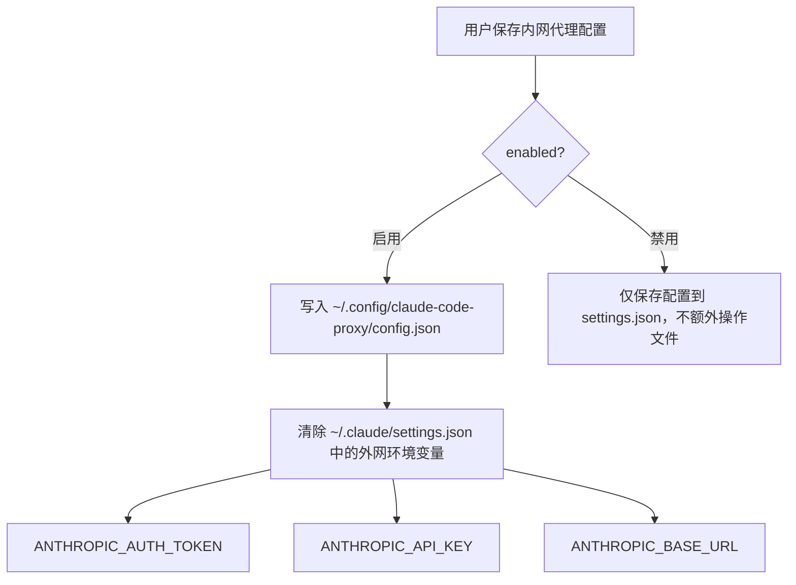
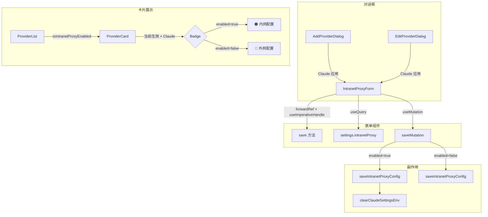

# 内网代理配置功能 - 需求文档

> 分支: `husu/alibaba_test`
> 版本: `3.12.4-fliggy`
> 创建者: husu
> 日期: 2026-03-31

---

## 一、功能概述

为 cc-switch 应用新增**内网 Claude Code Proxy 配置**能力，允许用户在 Claude 页面直接配置内网代理连接参数，实现外网/内网模式的一键切换，无需手动编辑配置文件。

## 二、核心需求

### 2.1 内网代理配置管理

| 需求项 | 说明 |
|--------|------|
| 配置字段 | API Key、Base URL、Model Mapping（small_model / model / opus_model）、Search API Key |
| 存储位置 | `~/.cc-switch/settings.json` 的 `intranetProxy` 字段 |
| 配置同步 | 支持从 `~/.config/claude-code-proxy/config.json` 反向同步到表单 |
| 降级方案 | H5/浏览器环境下使用 localStorage 降级存储 |

### 2.2 启用/禁用副作用



> 注意：禁用内网代理时不删除 `~/.config/claude-code-proxy/config.json`，保留用户配置以便后续重新启用。

### 2.3 UI 入口

内网代理配置以 **Tab 页** 形式嵌入以下两个对话框中：

1. **新增供应商对话框** (`AddProviderDialog`)：Claude 应用时显示第三个 Tab "内网配置"
2. **编辑供应商对话框** (`EditProviderDialog`)：Claude 应用时显示双 Tab "供应商配置" / "内网配置"

### 2.4 供应商卡片标识

在当前生效的 Claude 供应商卡片上显示配置模式 Badge：
- **内网配置**（橙色 Badge）：`intranetProxy.enabled === true`
- **外网配置**（天蓝色 Badge）：`intranetProxy.enabled === false` 或未配置

## 三、文件改动清单

### 新增文件

| 文件 | 说明 |
|------|------|
| `src-tauri/src/commands/intranet_proxy.rs` | Rust 后端：3 个 Tauri 命令 + 辅助函数 |
| `src/components/providers/IntranetProxyForm.tsx` | 嵌入式内网代理配置表单（forwardRef） |
| `src/components/providers/IntranetProxyCard.tsx` | 独立内网代理配置卡片（备用/未引用） |

### 修改文件

| 文件 | 改动说明 |
|------|----------|
| `src-tauri/src/commands/mod.rs` | 注册 `intranet_proxy` 模块 |
| `src-tauri/src/commands/settings.rs` | `get_settings` 自动填充内网代理配置（从 config.json 降级读取） |
| `src-tauri/src/lib.rs` | 注册 3 个新 Tauri 命令 |
| `src-tauri/src/settings.rs` | 新增 `IntranetProxyConfig` / `IntranetProxyModelMapping` 结构体 |
| `src-tauri/tauri.conf.json` | 版本号 `3.12.3` → `3.12.4-fliggy` |
| `src/types.ts` | 新增 `IntranetProxyConfig` / `IntranetProxyModelMapping` 类型定义，Settings 新增 `intranetProxy` 字段 |
| `src/lib/api/settings.ts` | 新增 3 个 API 方法 |
| `src/components/providers/AddProviderDialog.tsx` | 新增"内网配置" Tab |
| `src/components/providers/EditProviderDialog.tsx` | 新增"内网配置" Tab + 内网代理模式下跳过 live config 读取 |
| `src/components/providers/ProviderCard.tsx` | 新增 `isIntranetProxyEnabled` prop，显示内网/外网 Badge |
| `src/components/providers/ProviderList.tsx` | 透传 `isIntranetProxyEnabled` 到 ProviderCard |

### 非功能相关改动（建议单独提交）

| 文件 | 说明 |
|------|------|
| `pnpm-lock.yaml` | 依赖锁定文件更新 |
| `skills-lock.json` | Skill 锁定文件 |
| `.agents/skills/prompt/SKILL.md` | Skill 模板 |

## 四、后端 Tauri 命令

| 命令名 | 说明 |
|--------|------|
| `save_intranet_proxy_config` | 保存内网代理配置到 settings.json，启用时同时写入 `~/.config/claude-code-proxy/config.json` |
| `sync_intranet_proxy_from_file` | 从 `~/.config/claude-code-proxy/config.json` 读取并同步到 settings.json |
| `clear_claude_settings_env` | 清除 `~/.claude/settings.json` 中的外网 ANTHROPIC_* 环境变量 |

## 五、配置文件格式

### settings.json 中的 intranetProxy 字段

```json
{
  "intranetProxy": {
    "enabled": true,
    "apiKey": "sk-xxx",
    "baseUrl": "https://your-proxy.internal/v1",
    "modelMapping": {
      "smallModel": "claude-3-haiku",
      "model": "claude-sonnet-4-20250514",
      "opusModel": "claude-opus-4-20250514"
    },
    "searchApiKey": "sk-search-xxx"
  }
}
```

### ~/.config/claude-code-proxy/config.json 输出格式

```json
{
  "apiKey": "sk-xxx",
  "baseURL": "https://your-proxy.internal/v1",
  "modelMapping": {
    "small_model": "claude-3-haiku",
    "model": "claude-sonnet-4-20250514",
    "opus_model": "claude-opus-4-20250514"
  },
  "searchApiKey": "sk-search-xxx"
}
```

> 注意：config.json 中 modelMapping 使用 snake_case 命名，baseURL 为大写 URL。

## 六、已知问题与修复

### 编辑对话框闪烁（已修复）

**问题**：点击"编辑"时，供应商配置 Tab 的 API Key 输入框会短暂闪烁（出现又消失）。

**根因**：`EditProviderDialog` 的 `useEffect` 依赖 `isIntranetProxyEnabled`，该值由异步 `useQuery("settings")` 驱动。在 settings 查询尚未返回时，`isIntranetProxyEnabled` 为 `false`，导致 effect 错误进入 live config 读取分支，读到的 live 配置中 API Key 已被清除。

**修复**：增加 `settings === undefined` 守卫，Claude 应用在 settings 未加载完成前不执行 live config 读取。

```tsx
// EditProviderDialog.tsx useEffect 内新增守卫
if (appId === "claude" && settings === undefined) {
  return;
}
```

## 七、前端 API 方法

| 方法名 | 调用的 Tauri 命令 | 说明 |
|--------|-------------------|------|
| `settingsApi.saveIntranetProxyConfig(config)` | `save_intranet_proxy_config` | 保存内网代理配置 |
| `settingsApi.syncIntranetProxyFromFile()` | `sync_intranet_proxy_from_file` | 从 config.json 同步配置 |
| `settingsApi.clearClaudeSettingsEnv()` | `clear_claude_settings_env` | 清除外网环境变量 |

## 八、组件架构


